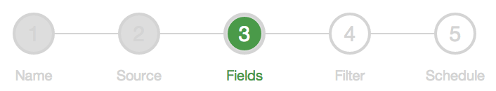

What is it?
===========
`progressStep.js` is a [jQuery][] plugin that dynamically renders a progress bar with numbered steps, like this:



Dependencies
============
`progressStep.js` uses the [jQuery][] library for DOM manipulation, and [Raphaël][] for rendering the progress bar itself. It does not use the new jQuery widget factory, so you can use it with jQuery prior to v1.8. I chose Raphaël because it provides compatibility to legacy browsers, including IE8.

How do I use it?
================
The base case is straightforward: 

1. Create a `<div>` to hold the progress bar; give it some dimensions (i.e., set the width and height) — `progressStep.js` will fill these dimensions with the control.
2. Create a jQuery object for the `<div>`, and invoke the `progressStep()` method on it to instantiate and return a progress bar.
3. Call the `addStep()` method on the progress bar once for each step in your process.
4. Call `refreshLayout()` to correctly size and position everything onscreen. 
5. Call the `setCurrentStep()` method to cycle through the steps; optionally, add event handlers to the steps so that you can handle click events or do pre- and post-processing as needed. 

For example:  
```javascript  
var $progressDiv = $("#progressBar");  
var $progressBar = $progressDiv.progressStep();  
$progressBar.addStep("First");  
$progressBar.addStep("Second");  
$progressBar.addStep("Third");  
$progressBar.refreshLayout();  
$progressBar.setCurrentStep(0);  
```

Function reference
==================

Options and Defaults
--------------------
Unfortunately, the graphics which Raphaël generates ([VML][] in IE8, and [SVG][] elsewhere) are not completely style-able using CSS, so you need to pass styling cues to `progressStep` as configuration parameters.  

The `progressStep()` method optionally takes an options object that you can use to specify styling and some basic dimensions. The overall size of the control is dictated by the dimensions of the `<div>` tag which contains it. You can modify the default options by setting the values on `progressStep.defaults`. 

* **activeColor**: The color used to highlight the current step.
* **strokeColor**: The color used to draw lines and text.
* **fillColor**: The color used to draw the foreground of unvisited steps.
* **visitedFillColor**: The color used to draw the foreground of visited steps.
* **margin**: The margin, in pixels, to the left and right of the progress bar. The bar is centered vertically within the `<div>`, so there is no top/bottom equivalent.
* **radius**: The radius, in pixels, of the outer circle for each step.
* **labelOffset**: The offset from the center line of the progress bar to the top of the label text.
* **font-family**: The font family used for the labels and numbers on each step.
* **font-size**: The label font size. (Number size is set automatically based on the radius option.)
* **font-weight**: The weight of the label and number fonts. 

For example, if you want to a `progressStep` instance with a yellow foreground color, you can set the `fillColor` option on creation:

```javascript  
var $progressDiv = $("#progressBar");  
var $progressBar = $progressDiv.progressStep({ fillColor: "yellow" });
``` 

Alternatively, if you decide you want *all* new instances of `progressStep` to use a blue line color, then you can set the `strokeColor` default:

```javascript  
$.fn.progressStep.defaults.strokeColor = "blue";
```

`progressStep` Methods
----------------------

###progressStep(options)###
Creates a new step-wise progress bar and binds it to the `<div>` on which this method is called. If invoked more than once on the same jQuery object, will return a single instance; however, if you create a new jQuery object for the same div, you will end up with more than one progress bar.

**parameters**  
*options* (object): Configuration options for the progress bar instance. See "Options and Defaults" for details.

**returns**  
The progress bar instance.


###getClickEnabled()###
Indicates whether user interactions are enabled. If enabled, any `onClick` event handlers you have added to the step objects in the progress bar will be invoked.

**parameters**  
(none)

**returns**  
`true` (default) if user clicks trigger event callbacks; `false` if user interactions are disabled.

###setClickEnabled(enabled)###
Determines whether user interactions are enabled. If enabled, any `onClick` event handlers you have added to the step objects in the progress bar will be invoked.

**parameters**  
*enabled* (boolean): Pass `true` to enable user interaction with the control; `false` to ignore user clicks.

**returns**  
(none)

###getOptions()###
Returns the control's set of options. See "Options and Defaults" above for an explanation of each one.

**parameters**  
(none)

**returns**  
Options bound to the control instance.

###getSteps()###
Returns the array of steps in the progress bar. NOTE: you should not modify this array directly; instead, call the `addStep()` method to create and push a new step onto the list.

**parameters**  
(none)

**returns**  
The array of steps in the progress bar. 

###getStep(stepIndex)###
A convenience method which returns the step at the index position specified. Checks step array bounds before retrieving, so the return value will be `null` if there is no step defined at the requested position.

**parameters**  
*stepIndex* (integer): A zero-based index for the desired step in the list.

**returns**  
A step object if one exists at the position; otherwise `null`.

###getCurrentStep()###
Provides the index of the currently active step.

**parameters**  
(none)

**returns**  
The index of the current active step, or -1 if there is no active step.

###setCurrentStep(stepIndex)###
Moves the progress bar to the step at the index position specified. Triggers all before and after events on the current step (if any) and the newly selected step.

**parameters**   
*stepIndex* (integer): The index of the step to make active.

**returns**  
(none)

###addStep(name)###
Creates a new step with the given name and pushes it onto the list of available steps.

**parameters**  
*name* (string): The name assigned to the new step.

**returns**  
A new `step` object.

###refreshLayout()###
Positions all of the elements within the control. Required to properly render the progress bar for the first time, you may want to call invoke this method at other times in response to other changes (for example, after the size of the parent `<div>` element changes, or after you add a new step.)

**parameters**  
(none)

**returns**  
(none)

`step` Methods
--------------
Each step in the progress bar is exposed as an object. You can acquire a reference to a particular step from the return values of `addStep()` and `getStep()`, or by accessing the steps array returned by the `getSteps()` method of the progress bar.

Each step object exposes the following properties:

* **name** (string): The step name, to be displayed on the label below the step.
* **circle** ([Raphaël element][]): The step's outer circle. 
* **highlight** ([Raphaël element][]): The step's inner circle, which is visible only when the step is active.
* **label** ([Raphaël element][]): A textual element which displays the name just below the step.
* **number** ([Raphaël element][]): A textual element which displays the step number inside the step circle.
* **index** (integer): The index of the step in the steps collection. NOTE: if you manually modify the step collection directly (e.g., by removing a step), you should modify both this value and the number property's text value.
* **active** (boolean): Indicates whether the step is the currently active step in the progress bar. To make a step active, you should call the `setCurrentStep()` method on the progress bar, as this method will invoke the appropriate event handlers and update step visuals for both the previously active step and the newly active one.
* **visited** (boolean): Indicates whether the step has been active before. Rather than modify this property directly, you should call the step's `setVisited()` method, which properly renders the step according to the new `visited` value. 

###setVisited(visited)###
Sets the `visited` property on the step and (if necessary) re-renders the step to have the appropriate appearance for the new value.

**parameters**  
*visited* (boolean): The new `visited` value.

**returns**  
(none)

###onClick(function)###
Sets a callback function to handle user click events on the step. If the function returns `true`, then clicking on a step will set that step to active. The default implementation returns `false`.

**parameters**  
*function* (function): A function to handle the step's click event. 

**returns**  
(none)

###beforeEntry(function)###
Sets a callback function to handle pre-processing before a step becomes active. If the function returns `true` (default behavior), then the step will become active.

**parameters**  
*function* (function): A function to be invoked before the step becomes active.

**returns**  
(none)

###afterEntry(function)###
Sets a callback function to handle post-processing once a step has become active. The return value of the callback is ignored.

**parameters**  
*function* (function): A function to be invoked after a step has become active.

###beforeExit(function)###
Sets a callback function to handle pre-processing before a step becomes inactive. If the function returns `true` (default behavior), then the step will become inactive.

**parameters**  
*function* (function): A function to be invoked before the step becomes inactive.

**returns**  
(none)

###afterExit(function)###
Sets a callback function to handle post-processing once a step has become inactive. The return value of the callback is ignored.

**parameters**  
*function* (function): A function to be invoked after a step has become inactive.

**returns**  
(none)

License
=======
`progressStep.js` is free to use under the MIT license, which is included at the top of the un-minified version of the source. If you use the un-minified version, please include the license text as provided. 

I wrote this plugin while working for [Intuit][]'s [QuickBase][] team; Intuit is the copyright holder. 


[jQuery]: http://jquery.com/ 
[Raphaël]: http://raphaeljs.com/ 
[VML]: http://en.wikipedia.org/wiki/Vector_Markup_Language
[SVG]: http://en.wikipedia.org/wiki/Scalable_Vector_Graphics
[Raphaël element]: http://raphaeljs.com/reference.html#Element
[Intuit]: http://www.intuit.com/ 
[QuickBase]: http://quickbase.intuit.com/ 
